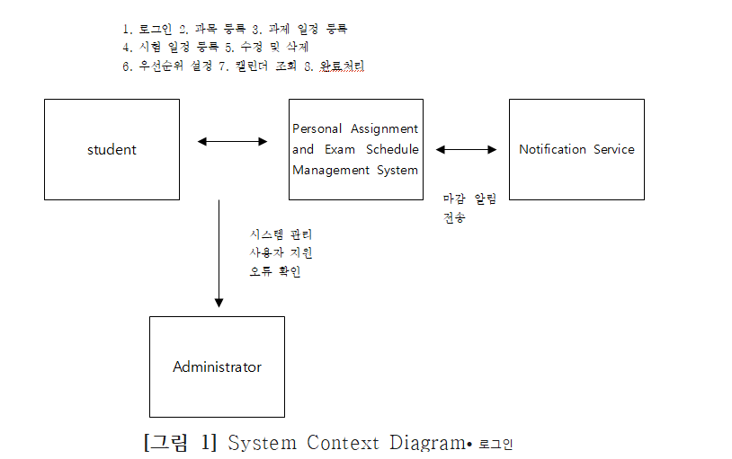
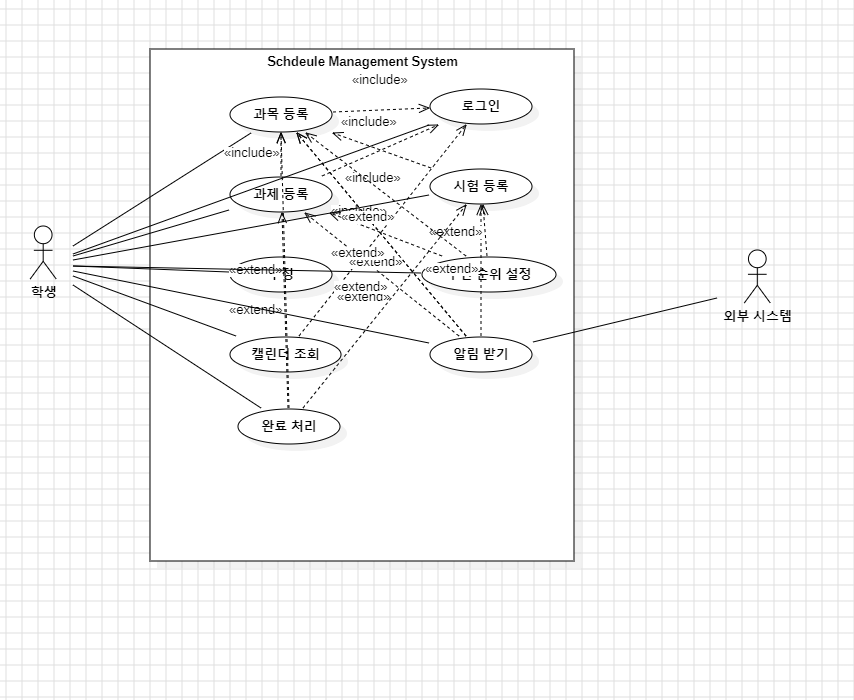

# Personal Assignment and Exam Schedule Management System  
(개인 과제/시험 일정 통합 관리)

---

# 1. conceptualization_22012135[백재열]

---

## Revision History

| Revision Date | Version | Description | Author |
|--------------|--------|------------|--------|

---

## Contents
1. Business Purpose  
2. System Context Diagram  
3. System Overview  
4. Use Case List  
5. Concept of Operation  
6. Problem Statement  
7. Glossary  
8. References  

---

# 1. Business Purpose

대학생은 한 학기 동안 여러 과목의 과제와 시험 일정을 동시에 관리해야 합니다.  
하지만 실제 학업 일정 정보는 LMS 공지, 강의자료, 메신저 대화, 개인 메모 등 여러 곳에 흩어져 있는 경우가 많습니다.  

이로 인해 학생들은 중요한 마감일을 놓치거나, 어떤 일을 먼저 해야 하는지 판단하기 어려워하며, 계획적인 학습 관리에 어려움을 겪습니다.

이 시스템의 목적은 학생들이 과제와 시험 일정을 한 곳에서 통합적으로 관리할 수 있도록 지원하는 것입니다.  

- 과목 등록  
- 과제 일정 등록  
- 시험 일정 등록  
- 일정 수정  
- 우선순위 설정  
- 캘린더 조회  
- 알림 수신  
- 완료 처리  

이 기능들을 통해 학생은 자신의 학업 일정을 보다 체계적으로 정리할 수 있습니다.

---

# 2. System Context Diagram

- 로그인  
- 과목 등록  
- 과제 일정 등록  
- 시험 일정 등록  
- 일정 수정 및 삭제  
- 우선순위 설정  
- 캘린더 조회  
- 완료 처리  
- 마감 알림 전송  
- 시스템 관리 / 사용자 지원 / 오류 확인  

---

# 3. System Overview

이 시스템은 대학생이 과제와 시험 일정을 한 곳에서 관리할 수 있도록 설계된 학업 일정 관리 시스템입니다.  

학생은 여러 과목을 동시에 수강하면서 과제 마감일과 시험 일정을 계속 확인해야 하지만, 실제 정보는 여러 곳에 분산되어 있습니다.  

이 시스템은 다음 기능을 제공합니다:

- 로그인  
- 과목 관리  
- 과제 일정 등록  
- 시험 일정 등록  
- 일정 수정 및 삭제  
- 우선순위 설정  
- 캘린더 조회  
- 알림 설정 및 수신  
- 완료 처리  

이를 통해 학생은 보다 체계적으로 학업을 관리할 수 있습니다.

---

# 4. Use Case List

| Use Case ID | Use Case Name | Primary Actor | Description |
|------------|--------------|--------------|------------|
| UC-01 | Sign In | Student | 시스템에 로그인 |
| UC-02 | Add Course | Student | 과목 등록 |
| UC-03 | Add Assignment Schedule | Student | 과제 일정 등록 |
| UC-04 | Add Exam Schedule | Student | 시험 일정 등록 |
| UC-05 | Edit Schedule | Student | 일정 수정/삭제 |
| UC-06 | Set Priority | Student | 우선순위 설정 |
| UC-07 | View Calendar | Student | 캘린더 조회 |
| UC-08 | Receive Notification | Student | 알림 수신 |
| UC-09 | Mark as Completed | Student | 완료 처리 |

---

# 5. Concept of Operation

## 1. 사용자 로그인
- Purpose: 사용자 인증  
- Approach: ID / Password 입력  
- Dynamics: 인증 후 메인 화면 이동  
- Goals: 승인된 사용자만 접근  

## 2. 과목 등록 및 관리
- Purpose: 과목 기반 일정 관리  
- Approach: 과목 입력  
- Dynamics: 저장 후 일정 등록에 활용  
- Goals: 선택 항목 제공  

## 3. 과제 일정 등록
- Purpose: 과제 마감 관리  
- Approach: 과목 + 과제 + 날짜 입력  
- Dynamics: 일정 저장  
- Goals: 통합 관리  

## 4. 시험 일정 등록
- Purpose: 시험 일정 관리  
- Approach: 시험명 + 날짜 입력  
- Dynamics: 저장  
- Goals: 사전 파악  

## 5. 일정 수정 및 삭제
- Purpose: 최신 상태 유지  
- Approach: 선택 후 수정/삭제  
- Dynamics: 즉시 반영  
- Goals: 오류 수정  

## 6. 우선순위 설정
- Purpose: 중요도 구분  
- Approach: 우선순위 지정  
- Dynamics: 저장 후 반영  
- Goals: 중요 일정 식별  

## 7. 캘린더 조회
- Purpose: 일정 시각화  
- Approach: 날짜별 정렬  
- Dynamics: 캘린더 표시  
- Goals: 일정 집중 구간 확인  

## 8. 알림 수신
- Purpose: 마감일 알림  
- Approach: 알림 설정  
- Dynamics: 시점 도달 시 알림  
- Goals: 마감 누락 방지  

## 9. 완료 처리
- Purpose: 완료/진행 구분  
- Approach: 완료 버튼 클릭  
- Dynamics: 상태 변경  
- Goals: 일정 구분  

---

# 6. Problem Statement

대학생은 다양한 학업 일정을 관리해야 하지만 정보가 분산되어 있어 효율적인 관리가 어렵습니다.  

특히 일정이 겹치는 경우 우선순위를 판단하기 어렵고, 일정 변경 시 반영이 번거롭습니다.  

기존 도구들은 학업 일정 관리에 특화된 기능이 부족합니다.

따라서 본 시스템은:

- 통합 일정 관리  
- 우선순위 설정  
- 알림 기능  
- 완료 처리  

를 제공하여 학업 효율성을 향상시키는 것을 목표로 합니다.

---

# 7. Glossary

| Term | Description |
|------|------------|
| Student | 사용자 |
| Course | 과목 |
| Assignment | 과제 |
| Exam | 시험 |
| Schedule | 일정 |
| Notification | 알림 |
| Calendar View | 캘린더 화면 |
| Completed Task | 완료된 작업 |
| Edit | 수정 |

---

# 8. References

1. LMS 공지  
2. 수업 자료  

# 2. Analysis_[22012135_백재열]

---

## Student No
22012135  

## Name
백재열  

## E-Mail  
bjy609@naver.com

---

# 1. Introduction  

## 1.1 Executive Summary  

대학생은 한 학기 동안 여러 과목을 수강하며 다양한 과제와 시험 일정을 동시에 관리해야 한다. 그러나 실제 학업 환경에서는 일정 정보가 LMS 공지사항, 강의자료, 메신저, 개인 메모 등 여러 경로에 분산되어 있어 체계적인 관리가 어렵다.  

이로 인해 학생들은 중요한 마감일을 놓치거나, 여러 일정이 겹칠 때 우선순위를 판단하지 못하는 문제가 발생한다. 이러한 문제는 학업 수행의 효율성을 저하시킨다.  

본 시스템은 이러한 문제를 해결하기 위해 과제 및 시험 일정을 통합적으로 관리하고, 우선순위 설정 및 알림 기능을 통해 효율적인 학습 계획 수립을 지원하는 것을 목표로 한다.  

---

## 1.2 Business Goals  

- 학업 일정 통합 관리  
- 마감일 누락 방지  
- 우선순위 기반 일정 관리  
- 체계적인 학습 계획 지원  
- 사용자 편의성 향상  

---

## 1.3 Technical Goals  

- 사용자 인증 기반 접근 제어  
- 일정 데이터의 안정적 저장  
- 빠른 일정 조회 및 처리  
- 직관적인 사용자 인터페이스 제공  
- 확장 가능한 시스템 구조 설계  

---

# 2. Use Case Analysis  

## 2.1 Actors  

| Actor | Description |
|------|------------|
| Student | 시스템의 주요 사용자로, 일정 등록/조회/관리 수행 |
| Notification Service | 일정 알림을 전달하는 외부 시스템 |

---

## 2.2 Use Case List  

| Use Case Name | ID | Actor |
|---------------|----|-------|
| Sign In | UC-01 | Student |
| Add Course | UC-02 | Student |
| Add Assignment Schedule | UC-03 | Student |
| Add Exam Schedule | UC-04 | Student |
| Edit Schedule | UC-05 | Student |
| Set Priority | UC-06 | Student |
| View Calendar | UC-07 | Student |
| Receive Notification | UC-08 | Student |
| Mark as Completed | UC-09 | Student |

---

## 2.3 Use Case Description  

---

### 2.3.1 Sign In  

**Use Case ID**: UC-01  
**Use Case Name**: Sign In  

#### GENERAL CHARACTERISTICS

| Item | Description |
|------|-------------|
| Summary | Student가 시스템에 로그인하여 개인 학업 일정 데이터에 접근한다. |
| Scope | Integrated Academic Task Management System |
| Level | User level |
| Author | 백재열 |
| Status | Anaysis |
| Primary Actor | Student |
| Secondary Actor | None |
| Preconditions | Student 계정 정보가 시스템에 등록되어 있어야 한다. |
| Trigger | Student가 ID와 Password를 입력하고 로그인 버튼을 클릭한다. |
| Success Post Condition | Student는 메인 화면으로 이동하고 시스템 기능을 사용할 수 있다. |
| Failed Post Condition | 로그인 실패 메시지가 출력되고 로그인 화면에 머무른다. |

---

### 2.3.2 Add Course  

#### GENERAL CHARACTERISTICS

| Item | Description |
|------|-------------|
| Summary | Student가 수강 중인 과목 정보를 등록한다. |
| Scope | Integrated Academic Task Management System |
| Level | User level |
| Author | 백재열 |
| Status | Anaysis |
| Primary Actor | Student |
| Secondary Actor | None |
| Preconditions | Student가 로그인되어 있어야 한다. |
| Trigger | Student가 과목 등록 기능을 선택한다. |
| Success Post Condition | 등록된 과목이 일정 등록 시 선택 항목으로 제공된다. |
| Failed Post Condition | 과목 정보가 저장되지 않는다. |

---

### 2.3.3 Add Assignment Schedule  

#### GENERAL CHARACTERISTICS

| Item | Description |
|------|-------------|
| Summary | Student가 특정 과목의 과제 마감 일정을 등록한다. |
| Scope | Integrated Academic Task Management System |
| Level | User level |
| Author | 백재열 |
| Status | Anaysis |
| Primary Actor | Student |
| Secondary Actor | None |
| Preconditions | Student가 로그인되어 있어야 하며, 과목이 하나 이상 등록되어 있어야 한다. |
| Trigger | Student가 과제 일정 등록 기능을 선택한다. |
| Success Post Condition | 과제 일정이 시스템에 저장되고 캘린더에 반영된다. |
| Failed Post Condition | 과제 일정이 저장되지 않는다. |

---

### 2.3.4 Add Exam Schedule  

#### GENERAL CHARACTERISTICS

| Item | Description |
|------|-------------|
| Summary | Student가 시험 일정을 등록한다. |
| Scope | Integrated Academic Task Management System |
| Level | User level |
| Author | 백재열 |
| Status | Anaysis |
| Primary Actor | Student |
| Secondary Actor | None |
| Preconditions | Student가 로그인되어 있어야 하며, 과목이 하나 이상 등록되어 있어야 한다. |
| Trigger | Student가 시험 일정 등록 기능을 선택한다. |
| Success Post Condition | 시험 일정이 시스템에 저장되고 캘린더에 반영된다. |
| Failed Post Condition | 시험 일정이 저장되지 않는다. |

---

### 2.3.5 Edit Schedule  

#### GENERAL CHARACTERISTICS

| Item | Description |
|------|-------------|
| Summary | Student가 기존 일정을 수정하거나 삭제한다. |
| Scope | Integrated Academic Task Management System |
| Level | User level |
| Author | 백재열 |
| Status | Anaysis |
| Primary Actor | Student |
| Secondary Actor | None |
| Preconditions | Student가 로그인되어 있어야 하며, 일정이 존재해야 한다. |
| Trigger | 일정 선택 후 수정 또는 삭제 |
| Success Post Condition | 변경 내용 반영 |
| Failed Post Condition | 기존 유지 |

---

### 2.3.6 Set Priority  

#### GENERAL CHARACTERISTICS

| Item | Description |
|------|-------------|
| Summary | 일정 우선순위 설정 |
| Scope | Integrated Academic Task Management System |
| Level | User level |
| Author | 백재열 |
| Status | Anaysis |
| Primary Actor | Student |
| Secondary Actor | None |
| Preconditions | 일정 존재 |
| Trigger | 우선순위 선택 |
| Success Post Condition | 우선순위 저장 |
| Failed Post Condition | 기본값 유지 |

---

### 2.3.7 View Calendar  

#### GENERAL CHARACTERISTICS

| Item | Description |
|------|-------------|
| Summary | 일정 캘린더 조회 |
| Scope | Integrated Academic Task Management System |
| Level | User level |
| Author | 백재열 |
| Status | Anaysis |
| Primary Actor | Student |
| Secondary Actor | None |
| Preconditions | 로그인 |
| Trigger | 캘린더 클릭 |
| Success Post Condition | 일정 표시 |
| Failed Post Condition | 오류 |

---

### 2.3.8 Receive Notification  

#### GENERAL CHARACTERISTICS

| Item | Description |
|------|-------------|
| Summary | 일정 알림 수신 |
| Scope | Integrated Academic Task Management System |
| Level | User level |
| Author | 백재열 |
| Status | Anaysis |
| Primary Actor | Student |
| Secondary Actor | Notification Service |
| Preconditions | 알림 설정 |
| Trigger | 알림 시간 도달 |
| Success Post Condition | 알림 전달 |
| Failed Post Condition | 전달 실패 |

---

### 2.3.9 Mark as Completed  

#### GENERAL CHARACTERISTICS

| Item | Description |
|------|-------------|
| Summary | 일정 완료 처리 |
| Scope | Integrated Academic Task Management System |
| Level | User level |
| Author | 백재열 |
| Status | Anaysis |
| Primary Actor | Student |
| Secondary Actor | None |
| Preconditions | 일정 존재 |
| Trigger | 완료 버튼 클릭 |
| Success Post Condition | 상태 변경 |
| Failed Post Condition | 유지 |

#### MAIN SUCCESS SCENARIO

| Step | Action |
|------|--------|
| 1 | Student가 일정 목록 또는 캘린더에서 완료할 일정을 선택한다. |
| 2 | 시스템은 선택된 일정의 상세 정보를 보여준다. |
| 3 | Student가 완료 처리 버튼을 클릭한다. |
| 4 | 시스템은 해당 일정의 상태를 Completed로 변경한다. |
| 5 | 시스템은 완료된 일정과 진행 중인 일정을 구분하여 표시한다. |

#### EXTENSION SCENARIOS

| Step | Branching Action |
|------|------------------|
| 3a | Student가 완료 처리를 취소하면 일정 상태는 변경되지 않는다. |
| 4a | 상태 변경에 실패하면 시스템은 오류 메시지를 출력한다. |
| 5a | 완료된 일정은 캘린더에서 별도 표시하거나 목록에서 구분한다. |

#### RELATED INFORMATION

| Item | Description |
|------|-------------|
| Performance | 완료 처리 요청 후 3초 이내 반영 |
| Frequency | 과제 제출 또는 시험 응시 후 |
| Priority | Medium |

---
# 3. Domain Analysis  

본 장에서는 시스템에서 사용되는 주요 개념들을 도출하고, 이를 클래스 단위로 정의하여 각 클래스 간의 관계를 분석한다.  
Domain Analysis를 통해 시스템의 구조를 명확히 이해하고, 이후 설계 단계(Class Diagram)로 확장할 수 있는 기반을 마련한다.

---

## 3.1 Domain 개요  

본 시스템은 대학생의 학업 일정 관리를 목적으로 하며, 주요 데이터는 과목, 과제, 시험, 일정으로 구성된다.  

각 객체는 서로 연관되어 있으며, 이를 통해 사용자는 학업 일정을 통합적으로 관리하고, 마감일 및 우선순위를 기반으로 효율적인 학습 계획을 수립할 수 있다.

---

## 3.2 Domain 클래스 정의  

### 1) Student (학생)  

Student는 시스템의 주요 사용자로, 학업 일정을 등록, 조회, 수정 및 관리하는 역할을 수행한다.

- **속성 (Attributes)**
  - studentID (학생 ID)
  - password (비밀번호)

- **기능 (Operations)**
  - signIn() (로그인)
  - addCourse() (과목 등록)
  - addSchedule() (일정 등록)
  - editSchedule() (일정 수정)
  - setPriority() (우선순위 설정)
  - viewCalendar() (캘린더 조회)
  - markCompleted() (완료 처리)

---

### 2) Course (과목)  

Course는 학생이 수강하는 과목을 의미하며, 모든 일정은 특정 과목에 속한다.

- **속성**
  - courseName (과목명)

- **기능**
  - addCourse() (과목 추가)
  - deleteCourse() (과목 삭제)

---

### 3) Schedule (일정)  

Schedule은 과제와 시험을 포함하는 상위 개념으로, 날짜 기반 학업 활동을 관리한다.

- **속성**
  - date (날짜)
  - status (진행 상태: 진행 중 / 완료)
  - priority (우선순위)

- **기능**
  - createSchedule() (일정 생성)
  - updateSchedule() (일정 수정)
  - deleteSchedule() (일정 삭제)
  - markCompleted() (완료 처리)

---

### 4) Assignment (과제)  

Assignment는 특정 과목에서 수행해야 하는 과제를 의미하며, Schedule의 하위 개념이다.

- **속성**
  - assignmentName (과제명)
  - dueDate (마감일)

- **기능**
  - addAssignment() (과제 등록)
  - updateAssignment() (과제 수정)

---

### 5) Exam (시험)  

Exam은 중간고사, 기말고사, 퀴즈 등 평가 일정을 의미하며, Schedule의 하위 개념이다.

- **속성**
  - examName (시험명)
  - examDate (시험일)

- **기능**
  - addExam() (시험 등록)
  - updateExam() (시험 수정)

---

### 6) Priority (우선순위)  

Priority는 일정의 중요도 또는 긴급도를 나타내는 요소이다.

- **속성**
  - level (우선순위 수준: 높음 / 보통 / 낮음)

- **기능**
  - setPriority() (우선순위 설정)

---

### 7) Notification (알림)  

Notification은 일정의 마감일이 가까워질 때 사용자에게 알림을 제공하는 기능을 담당한다.

- **속성**
  - notifyTime (알림 시간)

- **기능**
  - sendNotification() (알림 전송)

---

### 8) Calendar (캘린더)  

Calendar는 등록된 일정을 날짜 기반으로 시각화하여 사용자에게 보여주는 역할을 수행한다.

- **속성**
  - scheduleList (일정 목록)

- **기능**
  - displayCalendar() (캘린더 출력)
  - filterSchedule() (일정 필터링)

---

## 3.3 클래스 간 관계  

각 클래스 간의 관계는 다음과 같이 정의된다.

---

### 1) Student – Course  

- **관계 유형**: 1 : N  
- **설명**: 한 명의 Student는 여러 개의 Course를 등록할 수 있다.

---

### 2) Course – Schedule  

- **관계 유형**: 1 : N  
- **설명**: 하나의 Course는 여러 개의 Schedule(과제, 시험)을 포함한다.

---

### 3) Schedule – Assignment / Exam  

- **관계 유형**: 일반화(상속 관계)  
- **설명**: Assignment와 Exam은 Schedule을 상속받는 하위 클래스이다.

---

### 4) Schedule – Priority  

- **관계 유형**: 1 : 1  
- **설명**: 하나의 Schedule은 하나의 Priority를 가진다.

---

### 5) Schedule – Notification  

- **관계 유형**: 연관 관계(Association)  
- **설명**: 일정이 존재할 경우 Notification을 통해 알림이 발생한다.

---

### 6) Schedule – Calendar  

- **관계 유형**: 집합 관계(Aggregation)  
- **설명**: Calendar는 여러 개의 Schedule을 포함하여 시각적으로 표현한다.

---

## 3.4 Domain 모델 요약  

본 시스템의 Domain 모델은 Student를 중심으로 Course, Schedule, Assignment, Exam이 연결되는 구조를 가진다.  

Schedule을 중심으로 Priority와 Notification이 연결되며, Calendar는 이를 시각적으로 표현하는 역할을 수행한다.  

이러한 구조를 통해 시스템은 학업 일정을 통합적으로 관리하고, 사용자에게 효율적인 일정 관리 환경을 제공한다.

## 4.1 Login Screen  

- ID / Password 입력  
- 로그인 버튼 제공  

---

## 4.2 Main Dashboard  

- 전체 일정 요약 표시  
- 중요한 일정 강조 표시  

---

## 4.3 Schedule Registration  

- 과목 선택  
- 일정 입력  
- 저장 기능 제공  

---

## 4.4 Calendar View  

- 월별/주별 일정 표시  
- 일정 밀집도 확인 가능  

---

## 4.5 Notification  

- 마감일 전 알림 제공  
- 중요 일정 강조 표시  

---

# 5. Glossary  

| Term | Description |
|------|------------|
| Course | 수강 과목 |
| Assignment | 과제 |
| Exam | 시험 |
| Schedule | 일정 |
| Notification | 알림 |
| Priority | 우선순위 |
| Completed Task | 완료된 작업 |

---

# 6. References  

- LMS 공지사항  
- 강의자료  
- Conceptualization 문서  